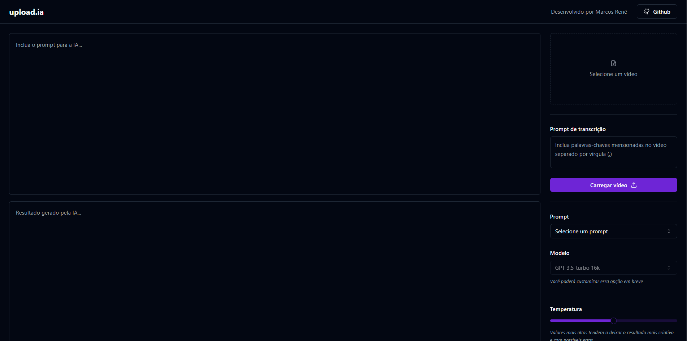

<h1 align="center">
  
  Upload.ai
</h1>

<p align="center">
  

  

  <a href="https://github.com/MarcosRene/NLW-AI/commits/main">
    
  </a>

   

   <a href="https://github.com/MarcosRene/NLW-AI/stargazers">
    
  </a>
</p>

<p>
  
</p>

## 💻 Sobre

O `Upload.ai` é uma aplicação que possibilita realizar upload de videos e por meio de IA, criar automaticamente títulos chamativos e descrições. O projeto foi desenvolvido durante o evento **NLW - Next Level Week** oferecida pela [Rocketseat](https://www.rocketseat.com.br/).

---

## 🛠 Technologies

Ferramentas utilizadas durante a contrução do projeto:

#### **Server**  ([NodeJS](https://nodejs.org/en/)  +  [TypeScript](https://www.typescriptlang.org/))

-   **[Fastify](https://www.fastify.io/)**
-   **[Zod](https://github.com/colinhacks/zod)**
-   **[Prisma](https://www.prisma.io/)**
-   **[PostgreSQL](https://www.postgresql.org/)**
-   **[OpenAI](https://github.com/openai/openai-node)**
-   **[Vercel AI SDK](https://github.com/vercel/ai)**

#### **Client**  ([Vite](https://vitejs.dev/)  +  [TypeScript](https://www.typescriptlang.org/))

-   **[Shadcn/UI](https://ui.shadcn.com/)**
-   **[TailwindCSS](https://tailwindcss.com/)**
-   **[RadixUI](https://www.radix-ui.com/)**
-   **[Lucide React](https://lucide.dev/)**
-   **[FFMpeg](https://ffmpegwasm.netlify.app/docs/overview)**
-   **[Axios](https://github.com/axios/axios)**
-   **[Vercel AI SDK](https://github.com/vercel/ai)**

---

#### 🎲 Rodando o Backend (Servidor)

```bash
# Clone este repositório
$ git clone git@github.com:MarcosRene/NLW-IA.git

# Acesse a pasta do projeto no terminal/cmd
$ cd NLW-IA

# Vá para a pasta server
$ cd server

# Instale as dependências
$ pnpm install

# Crie uma arquivo .env e preencha conforme apresentado no arquivo .env.example

# Executar seu banco de dados

# Executar o seguinte comando para criar as migrations no banco
$ npx prisma migrate dev

# Execute a aplicação em modo de desenvolvimento
$ pnpm dev

# O servidor inciará na porta:3333 - acesse http://localhost:3333
```

#### 🧭 Rodando a aplicação web (Frontend)

```bash
# Vá para a pasta da aplicação `clients`
$ cd clients

# Instale as dependências
$ pnpm install

# Execute a aplicação em modo de desenvolvimento
$ pnpm dev

# A aplicação inciará em alguma porta disponível que poderá ser acessada pelo navegador
```

## 📝 License

Este projeto está sob a licença MIT. Consulte o arquivo [LICENSE](./LICENSE) para mais informações.

Feito com 💜 por Marcos Renê 👋🏽 [Entre em contato!](https://www.linkedin.com/in/marcosrene/)
